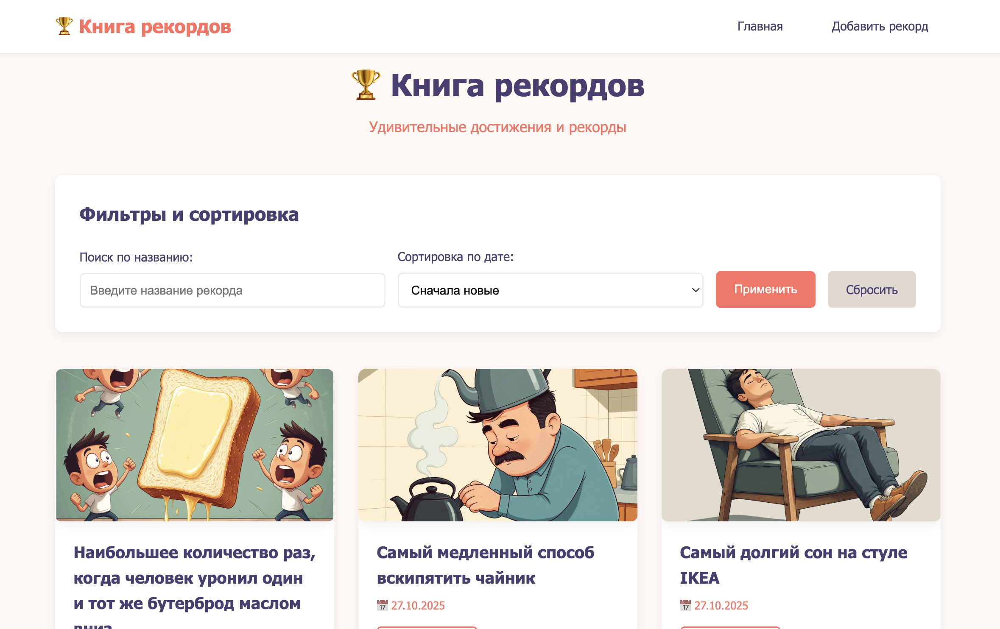

# Recordacion

Проект "Рекордасьон" - веб-приложение для ведения и просмотра рекордов.

## Скриншот приложения

{width=800 height=450}

## Технологии

- Django 5.2.7
- Python 3.13
- База данных: SQLite

## Установка и запуск проекта

### 1. Клонирование проекта

```bash
git clone <repository-url>
cd recordacios_webinar\ copy\ 5
```

### 2. Создание и активация виртуального окружения

```bash
# Создание виртуального окружения
python3.13 -m venv .venv

# Активация виртуального окружения (для macOS/Linux)
source .venv/bin/activate

# Активация виртуального окружения (для Windows)
.venv\Scripts\activate
```

### 3. Установка зависимостей

```bash
pip install -r requirements.txt
```

### 4. Создание и применение миграций

```bash
# Создание миграций
python manage.py makemigrations

# Применение миграций
python manage.py migrate
```

### 5. Создание администратора

```bash
# Создание суперпользователя с логином admin и паролем admin
python manage.py create-admin-user
```

### 6. Запуск сервера разработки

```bash
python manage.py runserver
```

После запуска сервер будет доступен по адресу: http://127.0.0.1:8000/

## Доступ к админ-панели

Админ-панель доступна по адресу: http://127.0.0.1:8000/admin/

- Логин: `admin`
- Пароль: `admin`

## Структура проекта

- `recordacion/` - основной проект Django с настройками
- `records/` - приложение для работы с моделями рекордов
- `records/models.py` - модели RecordEntry и RecordImage
- `records/admin.py` - настройка админ-панели
- `records/management/commands/create-admin-user.py` - кастомная команда для создания администратора

## Модели данных

### RecordEntry
- `title` - название рекорда
- `description` - описание
- `preview_image` - картинка для preview
- `images` - связанные картинки (ManyToMany)
- `created_at` - дата создания (автоматически)
- `updated_at` - дата обновления (автоматически)
- `is_approved` - флаг принятия администратором
- `approved_by` - кто принял рекорд (связь с User)

### RecordImage
- `image` - изображение
- `uploaded_at` - дата загрузки (автоматически)

## Дополнительные команды

### Создание администратора
```bash
python manage.py create-admin-user
```
Команда создаёт суперпользователя с логином `admin` и паролем `admin`. Если пользователь уже существует, команда пропускает создание.

### Создание миграций
```bash
python manage.py makemigrations
```

### Применение миграций
```bash
python manage.py migrate

## Запуск приложения через Docker

### 1. Сборка Docker-образа

```bash
docker build -t recordacion .
```

### 2. Запуск контейнера

```bash
docker run -p 8000:8000 \
  -v $(pwd)/db:/app/db \
  -v $(pwd)/media:/app/media \
  -e CONTAINER_NAME=recordacion \
  recordacion
```

### 3. Запуск в фоновом режиме

```bash
docker run -d -p 8000:8000 \
  -v $(pwd)/db:/app/db \
  -v $(pwd)/media:/app/media \
  -e CONTAINER_NAME=recordacion \
  --name recordacion-app \
  recordacion
```

### 4. Просмотр логов

```bash
docker logs recordacion-app
```

### 5. Остановка контейнера

```bash
docker stop recordacion-app
docker rm recordacion-app
```

### Особенности Docker-конфигурации

- **База данных**: SQLite файл сохраняется в папке `./db` (монтируется как volume)
- **Медиа файлы**: Загружаемые изображения сохраняются в папке `./media` (монтируется как volume)
- **Пользователь**: Приложение работает под непривилегированным пользователем с UID 1000
- **Автоматизация**: При запуске автоматически выполняются миграции и создается администратор
- **Доступ**: После запуска приложение доступно по адресу http://localhost:8000/
- **Админ-панель**: http://localhost:8000/admin/ (логин: `admin`, пароль: `admin`)

### Для развертывания в Cloud.ru Container Apps

Образ готов к развертыванию в Cloud.ru Container Apps. Убедитесь, что:
- Установлена переменная окружения `CONTAINER_NAME`
- Настроены volumes для папок `db` и `media`
- Порт приложения: 8000